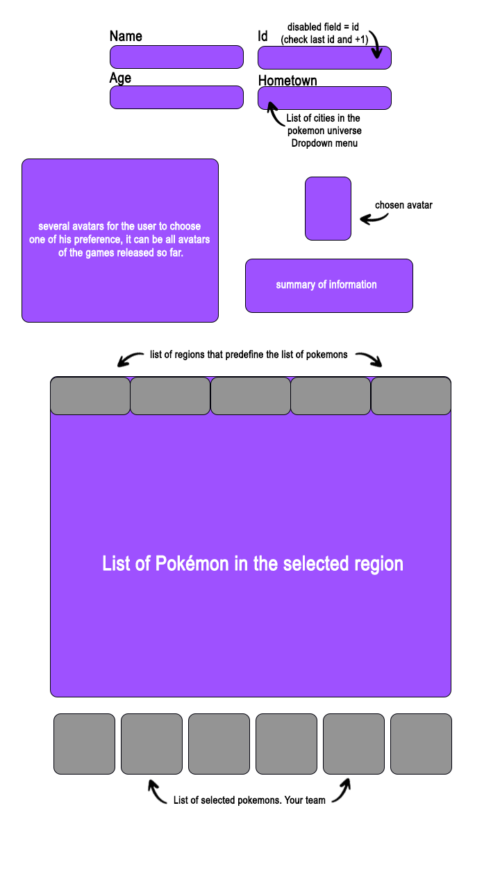

## Try Pokémon Trainer

A simple website, landing page, for programming practice 😊 and/or knowledge improvement.

## Concept

The user can access and make a "registration", putting the name of the trainer, his age and the city of origin of the Pokemon universe, then searches, by region, the list of Pokemon available to be added to his team.

Below the list is your team. To add correctly, you first need to click on the slot in the list and then on the pokémon you want to include.

## Technologies to be used

```bash
- Javascript / Typescript
- Next / React (Typescript)
- Tailwind

-- Below are some that will not be applied at the beginning of the project, but will be added at some point. --

- Node.Js or Java
- Any relational database
```

## Initial architecture

```bash
TryPokémonTrainer/
└── src/
    ├── components/
    ├── models/
    └──  pages/
```

## Installation

-- Clone the repo --

```bash
    git clone  https://github.com/gfmoreira/TryPokeTrainer.git
```

-- Install NPM packages in the root and client directories --

```bash
    cd TryPokeTrainer
    npm install
    cd client
    npm install
```

-- Start the application --

```bash
    npm run dev
```

## Wireframe TryPokemon



## Last Results 06/16/2023


At the moment we still have few Pokémon added, soon we will have more to the list and improvements, remembering that the code is in a development branch.
